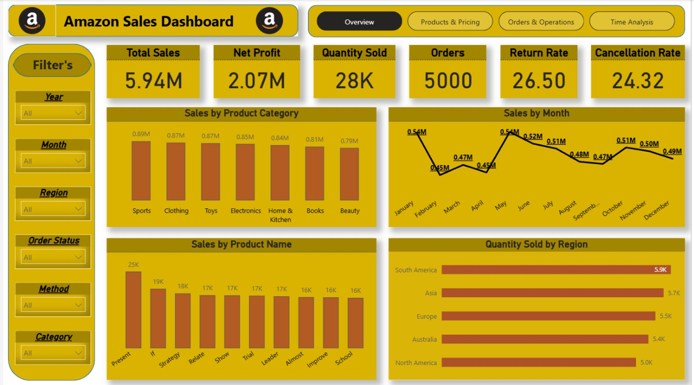
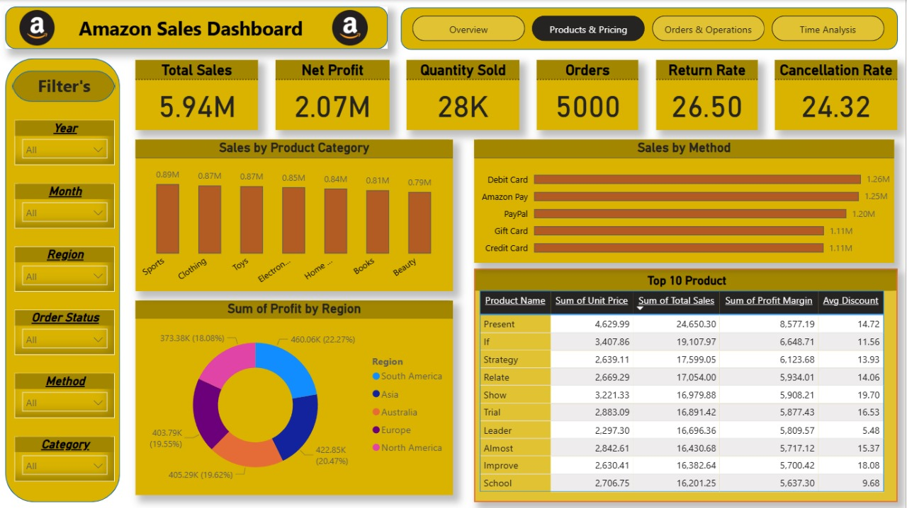
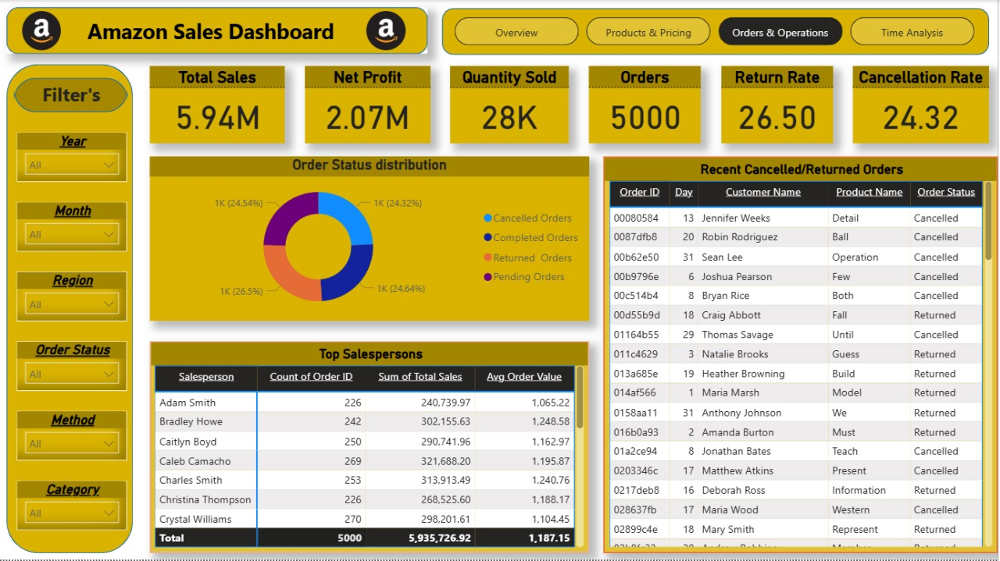
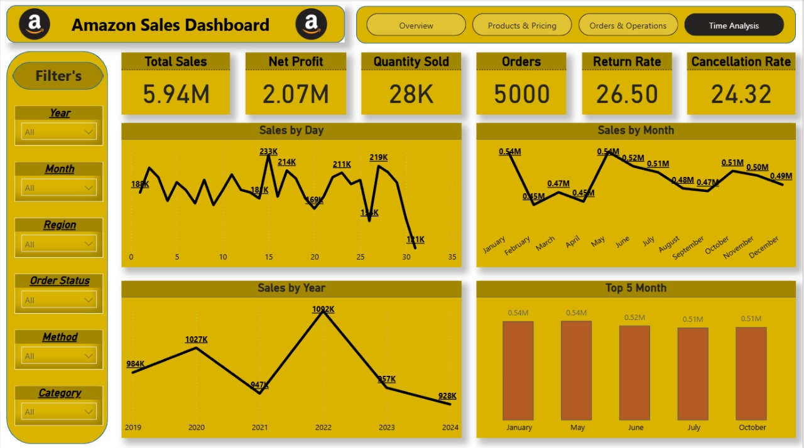

# 📦 Amazon Sales Performance Dashboard

## 1. 🎯 The Goal
The goal of this project is to analyze multi-year Amazon sales data using Power BI to uncover sales trends, customer behavior, and product performance.  
The analysis focuses on transforming raw transactional data into actionable insights that help improve product strategy, reduce losses, and optimize operations across regions.

This project answers critical business questions such as:

- How are sales performing over the years and months?  
- Which product categories and items generate the highest revenue and profit?  
- Which regions contribute most to sales and profitability?  
- What payment methods do customers prefer?  
- How do cancellations and returns impact total revenue?  

---

## 2. ❓ The Problem
Amazon faced challenges in understanding its long-term sales performance due to:

### **Data Issues & Operational Problems**
- High return and cancellation rates affecting net revenue.  
- Large product variety making it difficult to identify best- and worst-performing products.  
- Inconsistent regional performance requiring strategic focus.  
- Customer behavior variation (payment methods, purchase timing).  
- Limited visibility into salesperson performance and order-level details.

This analysis solves these issues by cleaning the data, modeling it properly, and visualizing key metrics in Power BI.

---

## 3. 📊 The Dashboard

### **Included Visuals**
- **Revenue by Month** → Seasonality and monthly demand trends.  
- **Revenue by Year** → Long-term performance growth.  
- **Revenue by Product Category** → Sports, Clothing, Toys, Electronics, etc.  
- **Revenue by Product Name** → Top-selling products like *Present*, *If*, *Strategy*, *Relate*, *Show*.  
- **Revenue by Region** → Quantity and profit distribution across South America, Asia, Europe, etc.  
- **Revenue by Payment Method** → Debit Card, Amazon Pay, PayPal, Gift Card, Credit Card.  
- **Order Status Distribution** → Completed, Cancelled, Returned, Pending.  
- **Sales by Day** → Daily trend visualization.  
- **Top 10 Products Table** → Unit Price, Total Sales, Profit Margin, Avg. Discount.  
- **Top Salespersons Table** → Performance comparison.  
- **Recent Cancelled/Returned Orders** → Detailed transactional view.

---

## 4. 🔢 KPIs

| Metric | Value |
|--------|--------|
| **Total Sales** | **5.94M** |
| **Net Profit** | **2.07M** |
| **Quantity Sold** | **28K** |
| **Orders** | **5,000** |
| **Return Rate** | **26.50%** |
| **Cancellation Rate** | **24.32%** |

**Dashboard Pages**  

---

## 5. 🛠️ How I Built It

### **Tools Used**
- **Power BI** for:  
  - Data modeling & relationships  
  - Interactive dashboards  
  - DAX calculations  
  - Advanced visuals  

### **Data Cleaning & Preparation**
- Removed duplicates and fixed inconsistent product names  
- Handled missing and invalid values  
- Standardized date formats  
- Calculated key measures: Profit, Profit Margin, Return/Cancellation %, Avg. Order Value  
- Created new fields: Month, Year, Region Groups, Status Flags

---

## 6. 💡 Key Insights

### **📌 High Sales but Serious Return/Cancellation Problems**
- Total Sales: **5.94M**  
- Return Rate: **26.50%** (very high)  
- Cancellation Rate: **24.32%**

### **📌 Top Categories**
Sports, Clothing, Toys, and Electronics dominate the revenue.

### **📌 Best-Selling Products**
Products like **“Present”** and **“If”** lead in sales and profit margin.

### **📌 Regional Trends**
- South America & Asia → highest quantity sold  
- North America & Asia → highest profit contribution  

### **📌 Payment Behavior**
Customers mostly use **Debit Card** and **Amazon Pay**.

### **📌 Seasonality**
- **May** and **June** are peak sales months  
- **January** also performs strongly  

### **📌 Sales Team Performance**
Adam Smith and Bradley Howe are the top performers.

---

## 7. 🚀 Recommendations

### **1. Reduce Return & Cancellation Rates**
- Investigate reasons for returns  
- Improve product descriptions & quality control  
- Offer exchange incentives instead of refunds  

### **2. Optimize Inventory for High-Demand Categories**
- Increase stock for Sports, Clothing, and Toys  
- Promote best-selling items like "Present" and "If"  

### **3. Focus on High-Profit Regions**
- Increase marketing in North America & Asia  
- Review pricing strategy in South America  

### **4. Enhance Payment Experience**
- Promote Amazon Pay and Debit Card  
- Offer incentives to boost Credit Card usage  

### **5. Seasonal Campaigns**
- Focus promotions in May, June, and January  

### **6. Improve Sales Team Strategy**
- Reward top performers  
- Use analytics to guide training and targets  

---

## 9. ✍️ About Me
**Mohamed Nasser**  
Data Analyst | BI Developer | Aspiring Data Scientist  

🔗 [LinkedIn](https://www.linkedin.com/in/mohamednasser)  

